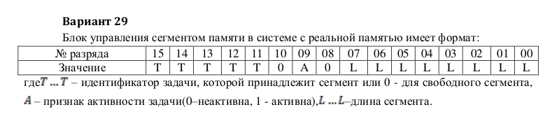

# Основы программирования. Лабораторная работа №3

## Программирование поразрядных операций

### Вариант 29



Сборка проекта:

```bash
make
```

В каталоге **bin** будут размещены две программы:

* pack - упаковщик даннх
* unpack - распаковщик данных

### Упаковка данных

```text
$ ./bin/pack 27 1 255
Pack.

Task identifier :27
Activity flag   :1
Segment length  :255

Encoded data HEX  :DAFF
Encoded data BIN  :1101101011111111

```

### Распаковка данных

```text
./bin/unpack DAFF
Unpack.

Encoded data HEX  :DAFF
Encoded data BIN  :1101101011111111

Task identifier :27
Activity flag   :1
Segment length  :255

```
